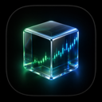

<p align="center">
  
</p>

<h1 align="center">MayStock</h1>

<p align="center">
  An elegant macOS menu bar app for real-time system monitoring and cryptocurrency tracking.
</p>

<p align="center">
  <a href="README_CN.md">中文文档</a> · <a href="LICENSE">MIT License</a>
</p>

---

## Features

- **Menu Bar Display** — Live metrics shown as `BTC 62213 | CPU 12% | MEM 8.2G | NET 1.5 KB/s`
- **Hover Popover** — Rich financial charts appear on mouse hover
- **Chart Types** — Candlestick (K-line), Depth, Volume, Line
- **Time Spans** — Configurable from 1s to 7 days
- **OKX WebSocket** — Real-time BTC/USDT data from OKX public API
- **System Monitors** — CPU, Memory, Network via native macOS APIs
- **Right-Click Settings** — Full configuration window with General, Monitors, Appearance tabs
- **Configurable** — Add/remove/reorder monitors, customize chart types and display labels

## Requirements

- macOS 26.0+ (Tahoe)
- Swift 6.0+

## Install

```bash
git clone https://github.com/yourname/MayStock.git
cd MayStock
make run
```

This builds in release mode, installs to `/Applications/MayStock.app`, and launches the app.

## Usage

| Action | Result |
|--------|--------|
| **Hover** menu bar item | Shows chart popover |
| **Left-click** menu bar item | Toggles chart popover |
| **Right-click** menu bar item | Opens context menu (Settings / Quit) |

### Makefile Commands

```bash
make build     # Build release binary
make install   # Build + install to /Applications
make run       # Build + install + launch
make clean     # Remove build artifacts and app
make uninstall # Remove from /Applications
```

## Architecture

```
Sources/MayStock/
├── App/                  — Entry point, AppDelegate, StatusBarController
├── Features/
│   ├── Charts/           — Candlestick, Depth, Volume, Line chart views
│   ├── Popover/          — Hover popover with chart selector
│   └── Settings/         — Settings window (General, Monitors, Appearance)
├── Services/
│   ├── MarketData/       — OKX WebSocket, message parser, data provider
│   ├── SystemMonitor/    — CPU, Memory, Network monitors
│   └── Configuration/    — JSON persistence
└── Models/               — Domain models (MonitorItem, OHLC, OrderBook, etc.)
```

## Data Sources

- **Cryptocurrency**: OKX WebSocket API v5 (`wss://ws.okx.com:8443/ws/v5/public`)
- **System Metrics**: Native macOS Mach/BSD APIs (`host_statistics`, `host_statistics64`, `getifaddrs`)

## License

[MIT](LICENSE)
